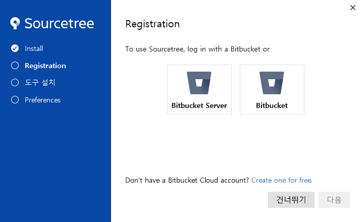
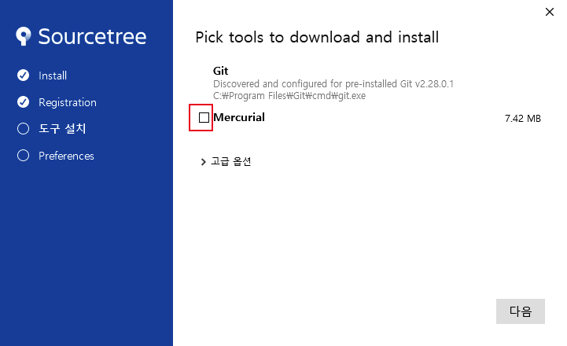
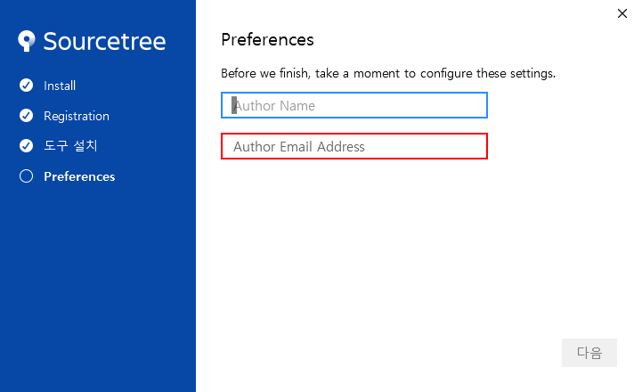
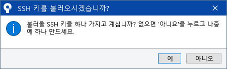

* 다운로드 링크 :

[https://product-downloads.atlassian.com/software/sourcetree/windows/ga/SourceTreeSetup-3.4.3.exe](https://product-downloads.atlassian.com/software/sourcetree/windows/ga/SourceTreeSetup-3.4.3.exe)

- 자동으로 다운로드가 시작됩니다.
- 다운로드 받은 exe 파일을 더블클릭해주세요.
- 건너뛰기(continue) 를 눌러주세요.

    

- Git 이 제대로 설치되어있으면 아래처럼 체크박스 없이 보일 꺼에요.  Mercurial 도 선택하지 않고 '다음(continue)' 버튼을 누르세요.
    - **만약 Git 에 체크박스 표시가 보인다면 Git 은 꼭 체크박스에 체크하고 넘어가주세요! 다시 Git 설정을 잡아주는 거라 체크만 하고 넘어간다면 괜찮습니다!**

    

- Author name 에 github username 을 , author email address 에 github 계정 이메일 주소를 입력하고 다음 버튼을 누르세요.

    
  
- 아래처럼 메시지가 뜨면 아니오 를 선택하세요.

    
