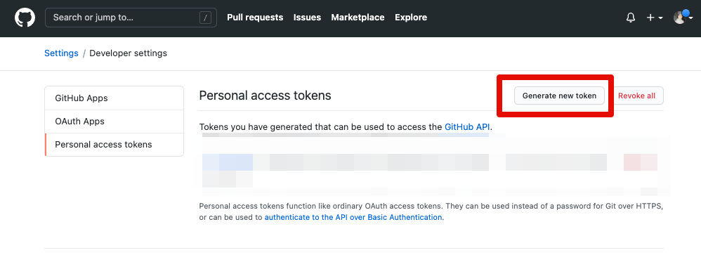
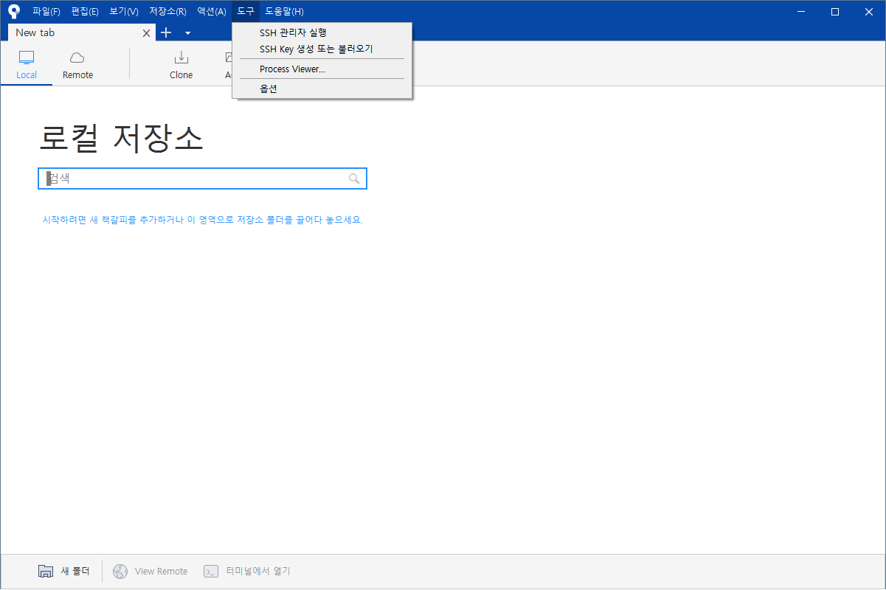
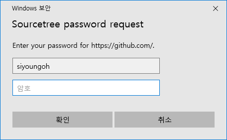

### 토큰 생성

sourcetree 에서 Github 을 사용하기 위해서 일종의 비밀번호(token)를 발급받아 사용할 거예요. 

1. [https://github.com/settings/tokens](https://github.com/settings/tokens) 링크에 접속해주세요. 로그인이 되어있지 않다면 로그인하라는 화면이 뜹니다. 로그인 후 아래 화면이 뜰 거예요.  
    - 만약 아래 화면이 보이지 않는다면 로그인 한 상태에서 다시 링크에 접속해주세요. [https://github.com/settings/tokens](https://github.com/settings/tokens) 😉
2. `Generate new token` 을 클릭해주세요. 

    

    - github 비밀번호를 입력한 후 초록색 버튼을 눌러주세요. 정말로 접근할 것인지를 확인하기 위해서 입니다.

    
   
3. note 에 sourcetree  라고 적고 아래처럼 체크박스를 선택해주세요. 어떤 기능을 사용할지 권한을 선택해주는 것입니다. 항목을 모두 선택하고 하단 초록색 `Generate token` 을 눌러주세요. 
    - note : 해당 token 의 이름입니다. 만약 기존에 있는 이름과 겹친다면 다른 이름으로 적어주세요.
    - 체크해야할 항목 : repo , workflow, admin:org, admin:public_key, gist, user, delete_repo

    
   
    4. 생성이 되면 하단 이미지의 빨간색 네모 친 클립보드 모양 버튼을 눌러주세요. token 값이 복사됩니다. 이것을 생성된 비밀번호라고 생각하면 됩니다. 

    - 이 token 값은 보안상의 이유로 절대로 다시 볼 수 없습니다. 만약 이 내용을 까먹었다면 새롭게 토큰을 발급받아야해요.
    - 하지만 보안상의 이유로 어딘가에 적어두는 것보다 token을 다시 발급하는게 좋습니다. 까먹었다면 다시 발급받으면 됩니다! 발급 횟수 제한 없습니다. 괜찮아요~!

        
      
    - 혹시 이따가 설정하기 전에 까먹을 수 있으니 일단 이 웹페이지는 닫지 말고 그대로 두세요!

  

### 소스트리에서 Github 계정 연동
1. 언어 한글로 설정하기
- 컴퓨터 설정에 따라 한국어가 아닌 다른 언어로 보일 수 있어요. 수업에서는 한국어를 기준으로 설명합니다!
- 상단 메뉴바에서 tools-option 을 눌러서 들어가주세요. 한국어 설정이 되어있는 경우, 도구-옵션 입니다.

    
- General - Repo setting - Language 에서 한국어를 선택해주세요.

    

- sourcetree 를 종료했다가 다시 켜주세요. 이제 한국어로 메뉴들이 보일 겁니다!

    
2. Github 계정 연동하기

- 도구 - 옵션 - 인증 을 들어가서 우측 상단의 추가 버튼을 눌러주세요.

    
    - 만약 아래처럼 계정 항목에 다른 내용들이 적혀있다면 해당 항목을 클릭 - 삭제 버튼을 눌러주세요.

        

    - 아래 화면에 각각 같게 설정을 선택해주세요. 사용자명은 내 Github Username 을 적어주세요. 모두 적은 후에 '비밀번호 새로고침' 버튼을 눌러주세요.

        

    - 아래와 같은 창이 뜨면, 암호 부분에 아까 **github 에서 설정했던 token 값을 붙여넣기** 해주세요.

        
        
    - 아래처럼 계정에 내 Github Username 이 보이면 잘 설정된 것입니다.

        

- 만약 Github token 으로 계정 설정이 안될 경우
    - 아래 화면에 각각 같게 설정을 선택해주세요. 사용자명은 내 Github Username 을 적어주세요. 모두 적은 후에 'OAuth 토큰 새로고침' 버튼을 눌러주세요.

        

    - 웹 브라우저에서 아래와 같은 창이 뜨면, Github 로그인 후 스크롤롤을 내려 초록색 `Authorize atlassian` 버튼을 눌러주세요. 만약 Github 사이트에 로그인이 되어있는 경우 바로  `Authorize atlassian` 가 있는 페이지로 연결될 거에요.

        

        

    - 웹 화면에 아래와 같은 메시지가 뜨면 잘 인증이 된 것입니다.

        

    - sourcetree 로 돌아와서 보면 아래처럼 보입니다. 하단에 `인증 성공` 이라는 메시지가 보이시죠? 😉 이제 확인 버튼을 누릅니다.

        

    - 아래처럼 계정에 내 Github Username 이 보이면 잘 설정된 것입니다.

        
