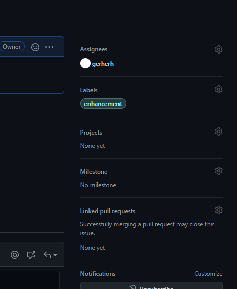
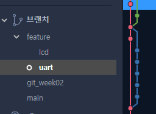

### 목차

* 협업을 위한 Git

  

### 1. 협업을 위한 Git

### 1.1 Issue  
   * 누구에게 할당된 이슈인지(Assigness), 어떤 종류의 이슈인지(Labels) 선택할 수 있다.  
   

  

    

   * 커밋 메시지에 이슈 번호를 함께 붙이면 그 커밋이 해당 이슈에 표시됨  
   

    

### 1.2. Branch
   * 브랜치 생성
   
      * 현재 진행중인 Branch에서 다른 기능을 추가하거나 수정하려고 할때  
       현재 진행중이던 브랜치는 그대로 두고 새로운 브랜치를 만들어서 작업할 수 있다  
      * 새 브랜치는 소스트리의 History에서 새 브랜치를 만들기 원하는 브랜치를 마우스 우클릭 한 후  
      브랜치를 클릭해서 만들 수 있다.  

     

 

   

    

   * 브랜치 이름을 정할때 feature/lcd, feature/uart와 같은 식으로 브랜치를 파일 구조같이 만들 수 있다.  

   

    

   

### 1.3. Merge
   * Merge, 병합  
     
       * 새로 만든 브랜치 작업이 다 끝나면 기존 브랜치에 병합할 수 있다  
       원본 브랜치로 이동한 후 병합버튼을 눌러서 작업한 브랜치를 선택 후 병합한다
       현재 main 브랜치에서 git_week02 브랜치를 병합할 것이다
   

      

    

   * Merge conflict, 병합 충돌  
      * 한개의 파일을 여러 브랜치에서 수정한 경우 그것을 합칠때(병합, merge) 문제가 생긴다.  
        그런데 같은 파일이라도 그냥 다른 부분을 각자 수정했으면 문제가 안되는데  
        동일한 부분에서 각자 다르게 수정한 경우 합칠때 문제가 된다.

     
  

    

  *  
    * 이런 식으로 충돌된 부분을 보여주는데  
    <<<<<<<<< HEAD, =========, >>>>>>>> sub 이런걸 지우고  
    현재 브랜치에서 수정한 내용이나 sub 브랜치에서 수정한 내용중 원하는 것을 남기고 커밋을 진행하면 된다.  
    head밑이 현재 브랜치에서 수정한 내용, ==== 밑이 합치려고 선택한 브랜치에서 수정한 내용

